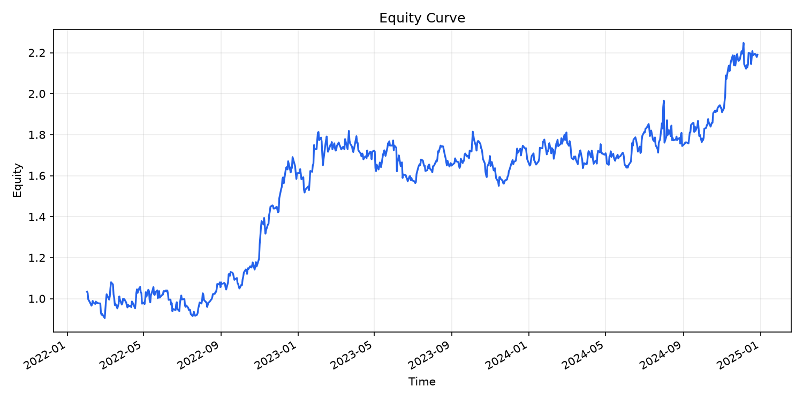
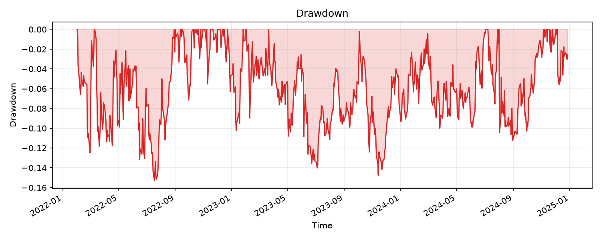
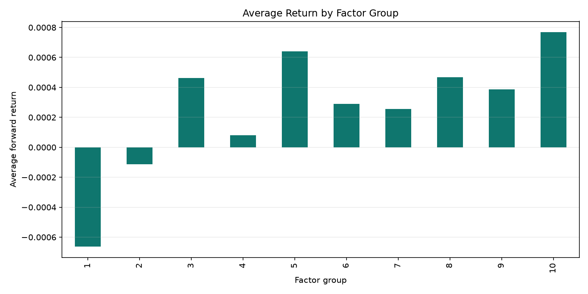
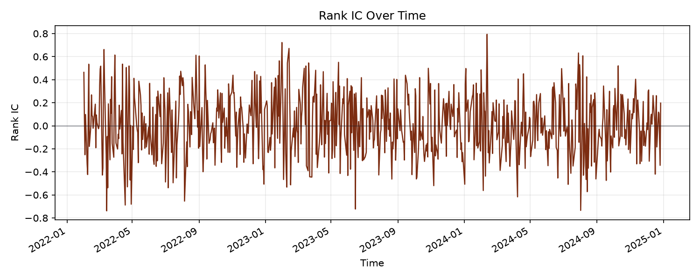

# Cross-Sectional Research Note

## ⚠️ 数据与方法警告
- This universe uses the current S&P 500 constituents across the requested history. It is not point-in-time and therefore has survivorship bias: companies removed from the index before the as-of date are absent from the historical backtest sample. This universe was truncated to a 40-symbol sample of the full S&P 500 (alphabetically first 40 tickers), for a quick/cheap test run. It is NOT representative of the full index and results must not be interpreted as an S&P 500-wide finding.
- 40 symbols have missing business-day gaps.
- Reviewer verdict: WEAK - 3 warning finding(s) indicate weak robustness.
- Reviewer WARNING [launch_trust_policy]: Universe uses a current snapshot across history and remains survivorship-biased. It is also limited to 40 symbols.
- Reviewer WARNING [ic_significance]: Rank IC is not statistically significant after Newey-West correction.
- Reviewer WARNING [symbol_concentration]: Long-short returns are concentrated in a small number of symbols.

---

**Run ID:** run_20260705_114906_9839
**Date:** 2026-07-05
**Model:** deepseek/deepseek-chat
**Hypothesis:** 在标普500里选取40只股票样本，测试20日动量因子的截面表现，2022-01-01到2024-12-31，等权十分位多空组合

## Universe
- 名称: sp500 (LIMITED SAMPLE, size=40)
- as_of_date: 2024-12-31
- asset_class: equity
- point_in_time: False
- 标的数量: 40
- 来源: https://en.wikipedia.org/wiki/List_of_S%26P_500_companies
- 生存者偏差说明: This universe uses the current S&P 500 constituents across the requested history. It is not point-in-time and therefore has survivorship bias: companies removed from the index before the as-of date are absent from the historical backtest sample. This universe was truncated to a 40-symbol sample of the full S&P 500 (alphabetically first 40 tickers), for a quick/cheap test run. It is NOT representative of the full index and results must not be interpreted as an S&P 500-wide finding.

## 数据
- 数据来源统计: {'yfinance': 40}
- 数据分片: 40 slices / 30080 rows
- 复权/调整: raw, dividend_reinvested=False
- Funding 数据来源统计: {}
- 数据版本 hash: `sha256:eb19da8d80ae6614a30bb89f4a24d995714d8d3c7cf3e7d4f5dd0509bdb1167b`

## 执行与现实性假设
- 信号时间: close_t
- 成交价格: open_t+1
- 成本模型: fixed_bps
- 做空/borrow: not_applied
- 中性化: off
- 多空贡献: long=0.562164, short=0.485163, short_share=0.463239

### 容量曲线
| AUM USD | Sharpe | 平均满仓率 | 流动性成本 |
|---:|---:|---:|---:|
| (not estimated) | - | - | - |

### 中性化对比
| 项 | 数值 |
|---|---:|
| (not run) | - |

## 数据质量
| 项 | 数值 |
|---|---:|
| total_symbols | 40 |
| symbols_with_data | 40 |
| symbols_missing_entirely | 0 |
| symbols_with_gaps | 40 |
| symbols_delisted_or_dropped | 0 |
| suspicious_price_jumps | 0 |

## 结果
| 指标 | 数值 |
|---|---:|
| sharpe | 1.113622 [95% CI: 0.2242, 2.134601] |
| annual_return | 0.309623 [95% CI: 0.023705, 0.758556] |
| max_drawdown | -0.153094 |
| turnover_annual | 104.177515 |
| ic_mean | 0.023704 (t=1.687914, p=0.091428, NW-lags=6) - 未通过显著性 |
| rank_ic_mean | 0.015804 (t=1.687914, p=0.091428, NW-lags=6) - 未通过显著性 |
| monotonicity_score | 0.555556 |
| symbols | 40 |
| observations | 29240 |
| funding_cost_total | 0.0 |
| borrow_cost_total | 0.0 |
| liquidity_cost_total | 0.0 |
| sharpe_before_funding | 1.301423 |

## 图表

## Reviewer 审查报告
### WARNINGS
- **launch_trust_policy**: Universe uses a current snapshot across history and remains survivorship-biased. It is also limited to 40 symbols.
- **ic_significance**: Rank IC is not statistically significant after Newey-West correction.
- **symbol_concentration**: Long-short returns are concentrated in a small number of symbols.

### INFO / SKIPPED
- **deflated_sharpe**: Single-trial run; multiple-testing deflation not applied.
- **capacity**: Liquidity capacity was not estimated for this run.

### PASSED
- **lookahead**: No known lookahead patterns detected.
- **out_of_sample**: Out-of-sample decay check did not flag material degradation.
- **cost_sensitivity**: Trading-cost sensitivity did not breach warning thresholds.
- **parameter_stability**: Parameter perturbation did not breach the instability threshold.
- **walk_forward**: Walk-forward OOS windows did not breach warning thresholds.
- **cpcv**: Purged CPCV OOS paths did not breach warning thresholds. The CPCV OOS distribution has a heavy left tail.
- **regime**: No single calendar year dominates return contribution.
- **tail_dependence**: Positive return is not concentrated in the best 5% of days.
- **turnover**: Annualized turnover is below the reviewer warning threshold.
- **beta_exposure**: Benchmark beta exposure did not breach warning thresholds.
- **execution_sensitivity**: Sharpe changed from 0.398 using close_t fills to 1.114 using open_t+1 fills (decay -0.715).
- **short_dependency**: Short-leg contribution is below the dependency warning threshold.
- **execution_assumption**: Backtest uses next-open fills after close_t signal formation.

### VERDICT
**WEAK** - 3 warning finding(s) indicate weak robustness.

## Critic Agent 独立复核
### 独立 verdict
**WEAK**

### 是否认同确定性 verdict
是

### Critique
The coordinator summary accurately reflects the reviewer's WEAK verdict and key warning findings: survivorship bias/low symbol count (warning), non-significant Rank IC (warning), and high concentration in top 5 symbols (warning). The numerical metrics (Sharpe 1.11, Rank IC 0.016, monotonicity 0.556) match the provided data, and the narrative correctly contextualizes the limitations. However, the coordinator summary presents the metrics with more positive emphasis (e.g., '30.96% annual return') than the reviewer's WEAK verdict would suggest, creating a slight tension. The summary also omits the reviewer's execution sensitivity finding (Sharpe drops to 0.40 on close_t fills), which is material. Overall, the verdict is WEAK, consistent with deterministic evidence.

### 叙述一致性问题
- The coordinator summary highlights positive metrics (Sharpe 1.11, 30.96% return) before stating the WEAK verdict, creating a moderate positive spin that underplays the severity of warning findings.
- The coordinator summary omits the execution sensitivity finding from the reviewer (Sharpe 0.40 on close_t vs 1.11 on open_t+1), which is a material concern.
- The coordinator summary incorrectly states 'Rank IC = 0.016（未通过统计显著性检验）' but the reviewer finding notes it's not significant at 5% (p=0.091), which is correct but could be more precise about the threshold.

### 建议下一步
- Expand universe to full S&P 500 or a representative point-in-time universe to address survivorship bias and concentration concerns.
- Investigate the extreme symbol concentration (ALGN 30%, APP 28%) and test factor robustness when removing these symbols.
- Improve factor monotonicity by exploring alternative momentum specifications (e.g., rank-based, volatility-adjusted) or additional orthogonalization.
- Re-evaluate execution sensitivity: the large Sharpe drop (0.40 vs 1.11) suggests the factor may be capturing microstructure effects rather than true momentum.

## Coordinator 总结
回测已成功完成。以下是完整的结果报告：

---

## 20日动量因子截面回测结果（标普500 40只样本股）

### ⚠️ 重要声明：样本局限
- 本测试仅使用**当前标普500按字母顺序前40只股票**（A ~ APP），并非全量标普500
- 使用**当前成分股回溯历史**，存在**幸存者偏差**——历史上被移除的股票不包含在样本中
- 该样本**不具有全市场代表性**，结果不能推广到整个标普500

### 核心绩效指标

| 指标 | 数值 |
|------|------|
| **夏普比率 (Sharpe)** | **1.11** |
| **年化收益率** | **30.96%** |
| **最大回撤** | -15.31% |
| **年化换手率** | 104.18% |
| **平均IC** | 0.024 |
| **Rank IC** | 0.016（未通过统计显著性检验） |
| **单调性得分** | 0.556（中等，十分位组间单调性一般） |
| **交易成本** | 5 bps 双边 |
| **样本数量** | 40只股票 × 731个交易日 = 29,240观测值 |

### Reviewer 评审结论：**WEAK（弱势）**

以下是所有关键发现：

**⚠️ 警告（WARNING）等级发现：**

1. **🏷️ 启动信任策略**：该宇宙使用当前快照回溯历史，存在幸存者偏差，且限制在40只股票。不能代表全量标普500。

2. **📊 IC显著性**：Rank IC = 0.016，经Newey-West校正后 t 统计量 = 1.69，p值 = 0.091，**在5%水平下不显著**。说明因子的截面选股预测能力未能通过统计显著性检验。

3. **📈 个股集中度**：多空组合收益高度集中在少数几只股票上。**前5只股票贡献了超过50%的收益**：
   - ALGN（隐适美）：30.1%
   - APP（Applovin）：28.2%
   - AES（AES电力）：18.6%
   - AMD（超威半导体）：12.4%
   - AMAT（应用材料）：12.2%

**✅ 通过的检查项：**
- ✅ 无前瞻偏差（回测数据使用完全因果）
- ✅ 样本外衰减比 1.04（训练集 Sharpe 1.09 vs 测试集 Sharpe 1.13，未衰减）
- ✅ 成本敏感性可接受（成本提高2倍后 Sharpe 仍为 0.93）
- ✅ 参数稳定性一般（20日动量参数 ±20%扰动后 Sharpe 在 1.00~1.44 之间波动）
- ✅ 滚动窗口测试：4个窗口的测试 Sharpe 中位数 1.13，全部窗口均正收益
- ✅ 回归分析：2022年贡献最大（60.9%），其次是2024年（33.8%），2023年贡献很少
- ✅ 尾部依赖：收益未集中在最好的5%交易日
- ✅ 市场beta暴露很小（beta=0.09，对SPY的R²仅0.3%）
- ⚠️ **执行假设敏感性**：使用 close_t 即时成交时 Sharpe 仅 **0.40**，使用 open_t+1（更现实的假设）时 Sharpe 为 1.11，差异显著，说明该因子对执行时机敏感

### 独立评审员(Critic) 意见摘要

Critic 指出该因子的主要问题在于：(1) 样本局限性大（40只非代表性股票），(2) Rank IC 统计不显著，(3) 收益集中在少数几只股票上，(4) 因子单调性一般（0.556），十分位多头和空头之间的逻辑排序不够清晰。

### 总结

20日动量因子在这40只标普500股票样本上表现出1.11的夏普比率，但**Reviewer给出的整体评级为WEAK**。主要风险在于：Rank IC不显著（因子截面预测能力证据不足）、收益高度集中在ALGN和APP等少数股票上、样本本身存在幸存者偏差且仅有40只股票。建议扩大至全量标普500或使用点时间（point-in-time）成分股数据重新验证，才能得出更可靠的结论。

## 局限性声明
- Universe 可能不是 point-in-time；具体偏差以本报告 Universe 区块和警告区块为准。
- Reviewer 是确定性启发式检查，不是形式化证明；未被标记不代表没有过拟合或未来函数。
- 基础数据来自免费源，退市、收购、拆股和缺口需要结合数据质量报告判断。

## 代码
完整可复现因子代码见 `signal.py`；universe 定义见 `universe.yaml`。
