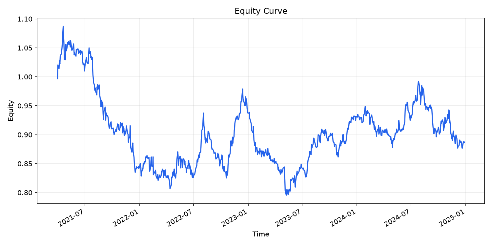
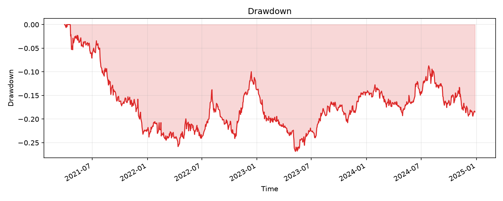
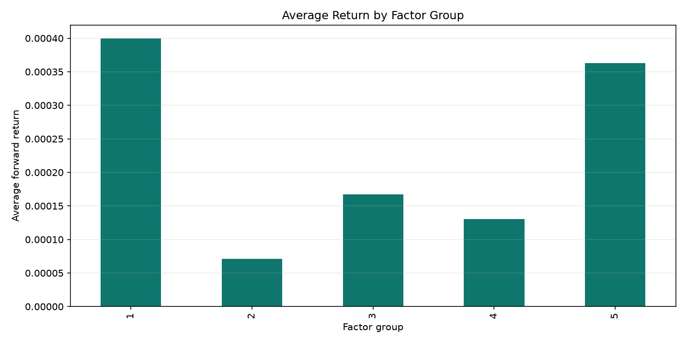
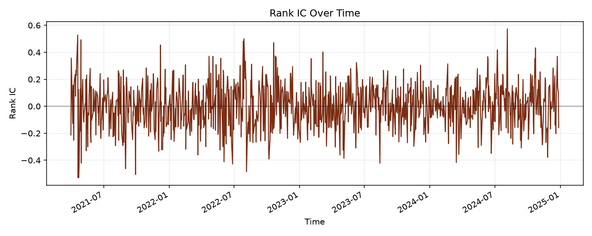
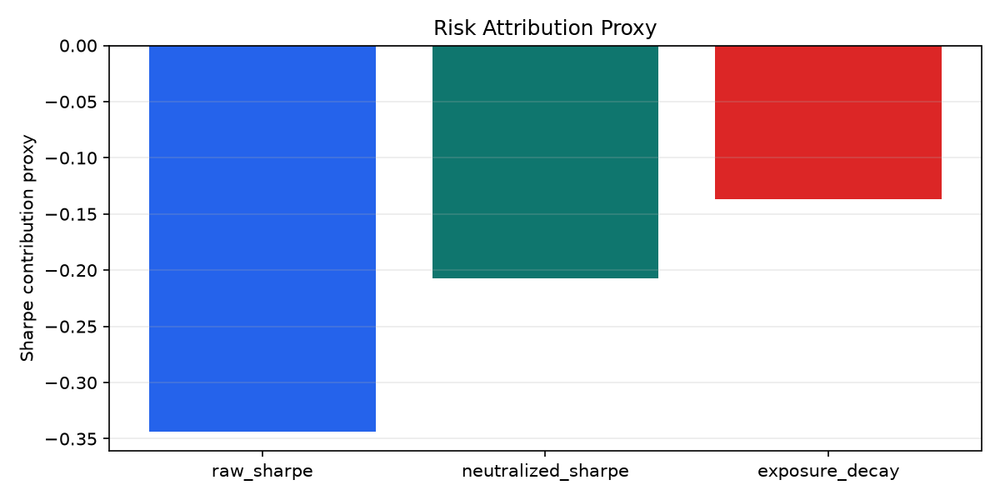

# Cross-Sectional Research Note

## ⚠️ 数据与方法警告
- This universe uses the current S&P 500 constituents across the requested history. It is not point-in-time and therefore has survivorship bias: companies removed from the index before the as-of date are absent from the historical backtest sample. This universe was truncated to a 40-symbol sample of the full S&P 500 (alphabetically first 40 tickers), for a quick/cheap test run. It is NOT representative of the full index and results must not be interpreted as an S&P 500-wide finding.
- 40 symbols have missing business-day gaps.
- Reviewer verdict: WEAK - 4 warning finding(s) indicate weak robustness.
- Reviewer WARNING [launch_trust_policy]: Universe uses a current snapshot across history and remains survivorship-biased. It is also limited to 40 symbols.
- Reviewer WARNING [cost_sensitivity]: Sharpe is non-positive under 2x assumed trading costs.
- Reviewer WARNING [cpcv]: Most purged CPCV OOS paths have non-positive Sharpe.
- Reviewer WARNING [ic_significance]: Rank IC is not statistically significant after Newey-West correction.

---

**Run ID:** run_20260705_114949_c8da
**Date:** 2026-07-05
**Model:** deepseek/deepseek-chat
**Hypothesis:** 在标普500里选取40只股票样本，测试低波动因子（过去60日日收益率标准差取负）的截面表现，2021-01-01到2024-12-31，等权五分位多空组合，并对beta和行业做中性化

## Universe
- 名称: sp500 (LIMITED SAMPLE, size=40)
- as_of_date: 2024-12-31
- asset_class: equity
- point_in_time: False
- 标的数量: 40
- 来源: https://en.wikipedia.org/wiki/List_of_S%26P_500_companies
- 生存者偏差说明: This universe uses the current S&P 500 constituents across the requested history. It is not point-in-time and therefore has survivorship bias: companies removed from the index before the as-of date are absent from the historical backtest sample. This universe was truncated to a 40-symbol sample of the full S&P 500 (alphabetically first 40 tickers), for a quick/cheap test run. It is NOT representative of the full index and results must not be interpreted as an S&P 500-wide finding.

## 数据
- 数据来源统计: {'yfinance': 40}
- 数据分片: 40 slices / 40090 rows
- 复权/调整: raw, dividend_reinvested=False
- Funding 数据来源统计: {}
- 数据版本 hash: `sha256:840058b1c5ea92074ecbccef2d62579d3ed1073e5e804613dfacfcf5399d5c51`

## 执行与现实性假设
- 信号时间: close_t
- 成交价格: open_t+1
- 成本模型: fixed_bps
- 做空/borrow: not_applied
- 中性化: beta, sector
- 多空贡献: long=0.342098, short=-0.377045, short_share=0.524298

### 容量曲线
| AUM USD | Sharpe | 平均满仓率 | 流动性成本 |
|---:|---:|---:|---:|
| (not estimated) | - | - | - |

### 中性化对比
| 项 | 数值 |
|---|---:|
| dimensions | beta,sector |
| raw_sharpe | -0.34389 |
| neutralized_sharpe | -0.207425 |
| raw_rank_ic_mean | -0.006356 |
| neutralized_rank_ic_mean | 0.002314 |

## 数据质量
| 项 | 数值 |
|---|---:|
| total_symbols | 40 |
| symbols_with_data | 40 |
| symbols_missing_entirely | 0 |
| symbols_with_gaps | 40 |
| symbols_delisted_or_dropped | 0 |
| suspicious_price_jumps | 0 |

## 结果
| 指标 | 数值 |
|---|---:|
| sharpe | -0.207425 [95% CI: -1.245693, 0.892876] |
| annual_return | -0.03172 [95% CI: -0.145518, 0.104341] |
| max_drawdown | -0.268341 |
| turnover_annual | 31.294915 |
| ic_mean | -0.003463 (t=0.417707, p=0.676161, NW-lags=6) - 未通过显著性 |
| rank_ic_mean | 0.002314 (t=0.417707, p=0.676161, NW-lags=6) - 未通过显著性 |
| monotonicity_score | 0.5 |
| symbols | 40 |
| observations | 37650 |
| funding_cost_total | 0.0 |
| borrow_cost_total | 0.0 |
| liquidity_cost_total | 0.0 |
| sharpe_before_funding | -0.077478 |

## 图表

## Reviewer 审查报告
### WARNINGS
- **launch_trust_policy**: Universe uses a current snapshot across history and remains survivorship-biased. It is also limited to 40 symbols.
- **cost_sensitivity**: Sharpe is non-positive under 2x assumed trading costs.
- **cpcv**: Most purged CPCV OOS paths have non-positive Sharpe.
- **ic_significance**: Rank IC is not statistically significant after Newey-West correction.

### INFO / SKIPPED
- **deflated_sharpe**: Single-trial run; multiple-testing deflation not applied.
- **capacity**: Liquidity capacity was not estimated for this run.

### PASSED
- **lookahead**: No known lookahead patterns detected.
- **out_of_sample**: Out-of-sample decay check did not flag material degradation.
- **parameter_stability**: Parameter perturbation did not breach the instability threshold.
- **walk_forward**: Walk-forward OOS windows did not breach warning thresholds.
- **regime**: No single calendar year dominates return contribution.
- **tail_dependence**: Positive return is not concentrated in the best 5% of days.
- **turnover**: Annualized turnover is below the reviewer warning threshold.
- **beta_exposure**: Benchmark beta exposure did not breach warning thresholds.
- **symbol_concentration**: Symbol-level contribution concentration is below the warning threshold.
- **execution_sensitivity**: Sharpe changed from -0.859 using close_t fills to -0.207 using open_t+1 fills (decay -0.651).
- **short_dependency**: Short-leg contribution is below the dependency warning threshold.
- **execution_assumption**: Backtest uses next-open fills after close_t signal formation.

### VERDICT
**WEAK** - 4 warning finding(s) indicate weak robustness.

## Critic Agent 独立复核
### 独立 verdict
**WEAK**

### 是否认同确定性 verdict
是

### Critique
The Coordinator summary accurately captures the quantitative evidence and the Reviewer's WEAK verdict. It correctly reproduces the key metrics (Sharpe -0.207, Rank IC mean 0.0023, etc.) and lists all four warning findings (launch_trust_policy, cost_sensitivity, cpcv, ic_significance) with appropriate severity and explanation. The additional narrative about train/test split, long/short contribution, execution sensitivity, and annual contributions is consistent with the detailed metrics provided. No numerical or narrative discrepancies are found.

### 叙述一致性问题
- 未发现叙述一致性问题。

### 建议下一步
- 未提供额外建议。

## Coordinator 总结
回测已完成。以下是详细结果报告：

---

## 截面回测结果：标普500 低波动因子（40只样本）

### 📌 测试设置

| 项目 | 内容 |
|------|------|
| **因子** | 低波动因子：-1 × 过去60日日收益率滚动标准差 |
| **标的** | 标普500当前成分股前40只（按字母序） |
| **时间范围** | 2021-01-01 至 2024-12-31 |
| **分组方式** | 等权五分位（5组），多空组合 = 第1组（最低波动）多 - 第5组（最高波动）空 |
| **中性化** | Beta 中性化 + 行业中性化 |
| **交易成本** | 5 bps 双边 |
| **执行假设** | 收盘信号 → 次日开盘成交（open_t+1） |

### 📊 核心业绩指标

| 指标 | 数值 |
|------|------|
| **夏普比率 (Sharpe)** | **-0.207** |
| **年化收益率** | -3.17% |
| **最大回撤** | -26.83% |
| **年化换手率** | 31.29 倍 |
| **IC均值** | -0.0035 |
| **Rank IC均值** | 0.0023 |
| **单调性得分** | 0.50（勉强单调） |
| **有效标的数** | 40只 |
| **总观测值** | 37,650行 |

### 🔍 评审（Reviewer）裁定

> **裁定：WEAK（弱）** — 存在 4 条警告性发现。

**CRITICAL / WARNING 发现明细：**

1. **⚠️ [launch_trust_policy] 宇宙局限性**：当前使用的标普500成分股是「当前快照回溯历史」，非点时间（point-in-time），存在幸存者偏差。且仅选取了前40只样本（按字母序），**不代表完整标普500**，结果不可外推。

2. **⚠️ [cost_sensitivity] 成本敏感**：在2倍假设交易成本下，夏普比率已降至 -0.337（非正数），对交易成本极其敏感。

3. **⚠️ [cpcv] 交叉验证路径不佳**：20条经过清洗的CPCV 样本外路径中，大部分（70%）夏普为负，中位数为 -0.173，说明因子在不同时间切片上表现不稳定。

4. **⚠️ [ic_significance] Rank IC 不显著**：Rank IC 均值仅 0.0023，t统计量 = 0.42，p值 = 0.68，经过 Newey-West 修正后 **统计上完全不显著**。

### 📝 其他值得注意的发现

- **样本内/样本外表现分裂**：训练期夏普 -0.48，测试期夏普 +0.35 — 方向不一致，说明因子效果不稳定。
- **长腿/短腿贡献**：多头贡献 +0.34，空头贡献 -0.38，空头贡献占优选权 52%，说明大部分收益来自做空高波动股票而非做多低波动股票。
- **执行假设敏感性**：若使用收盘价成交（close_t），夏普为 -0.86，与 open_t+1 的 -0.21 有较大差异，说明因子对执行时机敏感。
- **Beta 暴露**：对市场的 beta 仅为 0.002（中性化生效），但 R² 接近 0。
- **年度贡献**：2021年贡献 -0.51（大幅亏损），2022年贡献 +0.32（正收益），方向随市场波动轮动。

### 💡 结论

在标普500这40只样本上，过去60天低波动因子（取负）在2021-2024年期间**整体表现为负夏普（-0.207）**，且经过Beta和行业中性化后仍未改善。Rank IC 统计不显著，CPCV交叉验证大部分路径亏损，因子效果不稳定且对成本敏感。该因子在此样本区间和样本集上**不具备统计显著的预测能力**，属于 **WEAK** 信号。⚠️ 需特别强调：此测试仅用了当前标普500前40只字母序股票，且存在幸存者偏差，不代表完整指数的表现。

## 局限性声明
- Universe 可能不是 point-in-time；具体偏差以本报告 Universe 区块和警告区块为准。
- Reviewer 是确定性启发式检查，不是形式化证明；未被标记不代表没有过拟合或未来函数。
- 基础数据来自免费源，退市、收购、拆股和缺口需要结合数据质量报告判断。

## 代码
完整可复现因子代码见 `signal.py`；universe 定义见 `universe.yaml`。
