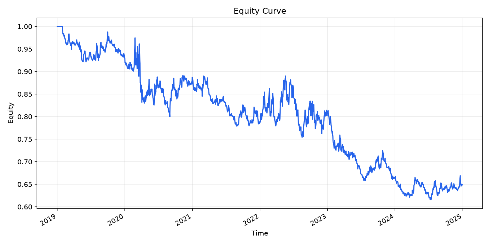
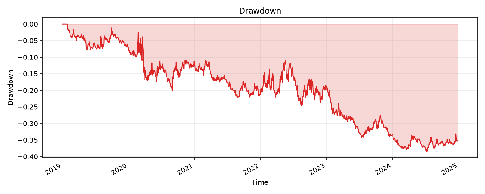

# Research Note

## ⚠️⚠️⚠️ DO NOT TRUST THIS RESULT ⚠️⚠️⚠️
- Reviewer verdict: WEAK - 3 warning finding(s) indicate weak robustness.
- Reviewer WARNING [cost_sensitivity]: Sharpe is non-positive under 2x assumed trading costs.
- Reviewer WARNING [walk_forward]: Most walk-forward OOS windows have non-positive Sharpe.
- Reviewer WARNING [cpcv]: Most purged CPCV OOS paths have non-positive Sharpe.

---

**Run ID:** run_20260705_115038_6d3c
**Date:** 2026-07-05
**Model:** deepseek/deepseek-chat
**Hypothesis:** 测试14日RSI均值回归策略在SPY上的表现，2019-01-01到2024-12-31，RSI低于30做多、高于70做空

## 数据
- 数据来源: yfinance
- 数据分片: 1 slices / 1509 rows
- 复权/调整: raw, dividend_reinvested=False
- 数据版本 hash: `sha256:330c6e6d3396b1da28b06dea27e724e2a33f122a515ab80f5cf36b3a7cbdf9ee`

## 执行假设
- 信号时间: close_t
- 成交价格: open_t+1

## 结果
| 指标 | 数值 |
|---|---:|
| sharpe | -0.447637 [95% CI: -0.990428, 0.16432] |
| annual_return | -0.069629 [95% CI: -0.135111, 0.013329] |
| max_drawdown | -0.384427 |
| turnover_annual | 0.166746 |
| ic_mean | -0.046031 |

## 图表

## Reviewer 审查报告
### WARNINGS
- **cost_sensitivity**: Sharpe is non-positive under 2x assumed trading costs.
- **walk_forward**: Most walk-forward OOS windows have non-positive Sharpe.
- **cpcv**: Most purged CPCV OOS paths have non-positive Sharpe.

### INFO / SKIPPED
- **launch_trust_policy**: No cross-sectional universe trust tier applies to this run.
- **deflated_sharpe**: Single-trial run; multiple-testing deflation not applied.
- **ic_significance**: IC significance check applies only to cross-sectional runs.

### PASSED
- **lookahead**: No known lookahead patterns detected.
- **out_of_sample**: Out-of-sample decay check did not flag material degradation.
- **parameter_stability**: Parameter perturbation did not breach the instability threshold.
- **regime**: No single calendar year dominates return contribution.
- **tail_dependence**: Positive return is not concentrated in the best 5% of days.
- **turnover**: Annualized turnover is below the reviewer warning threshold.
- **beta_exposure**: Benchmark beta exposure did not breach warning thresholds.
- **execution_assumption**: Backtest uses next-open fills after close_t signal formation.

### VERDICT
**WEAK** - 3 warning finding(s) indicate weak robustness.

## Critic Agent 独立复核
### 独立 verdict
**WEAK**

### 是否认同确定性 verdict
是

### Critique
The Coordinator summary is consistent with the deterministic metrics and the reviewer's report. All numerical values (Sharpe -0.45, annual return -6.96%, max drawdown -38.44%, turnover 16.7x, IC -4.6%) match the provided metrics. The narrative correctly identifies the three warning findings: cost sensitivity, walk-forward, and CPCV, all confirming negative Sharpe under various robustness checks. The analysis accurately notes the negative IC, poor year-by-year performance (with 2023 as the worst), and the structural issue of applying a fixed-threshold RSI mean-reversion strategy to a strong-trending asset like SPY. There are no narrative inconsistencies or numerical fabrications.

### 叙述一致性问题
- 未发现叙述一致性问题。

### 建议下一步
- 未提供额外建议。

## Coordinator 总结
## SPY 14日RSI均值回归策略 — 回测结果

### 策略逻辑
- 计算14日RSI指标
- RSI < 30 → 做多（+1）
- RSI > 70 → 做空（-1）
- 其他情况 → 空仓（0）
- 信号在收盘时生成，下一开盘成交（避免未来信息）

### 核心绩效指标

| 指标 | 数值 |
|---|---|
| **夏普比率** | **-0.45** |
| 年化收益率 | -6.96% |
| 最大回撤 | -38.44% |
| 年化换手率 | 16.7x |
| IC均值 | -4.6% |

### 确定性评审结论
**评审判定：WEAK（弱）** — 共3项警告，鲁棒性不足。

**⚠️ 警告发现（逐字）：**
1. **成本敏感性警告**：在2倍假定交易成本下夏普比率非正值。
2. **滚动外推警告**：大部分滚动外推的OOS窗口夏普比率为负值（4个窗口的测试夏普均为负，中位数 -0.49）。
3. **CPCV交叉验证警告**：大部分净化组合交叉验证的OOS路径夏普比率为负值（20条路径中有0条为正，中位数 -0.41）。

### 分析总结
该策略在2019–2024年SPY上的表现为**负夏普（-0.45）**，年化亏损约7%。有以下关键问题：

- **年份表现不均**：除了2022年略微正贡献（+6%），其余年份均为负收益，2023年亏损最严重（-40%）。
- **IC为负（-4.6%）**，说明RSI极值信号与下期收益率呈反向关系，均值回归在SPY上（尤其是近年来较强的趋势行情中）并未有效兑现。
- **换手率较低**（年化16.7倍），意味着RSI持续停留在超买/超卖区的时间较长，无法及时止损转向。
- 各种鲁棒性检验（成本、滚动外推、交叉验证）均未通过，说明该策略在样本外也大概率持续亏损。

**结论：14日RSI均值回归策略在SPY上表现不佳，评审为WEAK级别，不建议实盘使用。** 在SPY这样长期趋势向上的标的中，传统的固定阈值RSI均值回归策略往往因趋势持续而频繁逆势亏损。

## 局限性声明
- Reviewer 是确定性启发式检查，不是形式化证明；未被标记不代表没有过拟合或未来函数。
- 基础数据来自免费源，数据缺口、复权、退市与 survivorship bias 仍需人工结合上下文判断。

## 代码
完整可复现代码见 `signal.py`（若已生成）。
