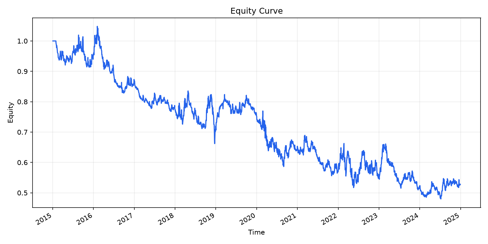
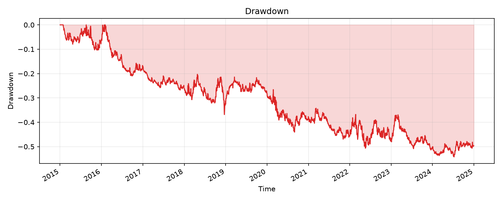

# Research Note

## ⚠️⚠️⚠️ DO NOT TRUST THIS RESULT ⚠️⚠️⚠️
- Reviewer verdict: WEAK - 3 warning finding(s) indicate weak robustness.
- Reviewer WARNING [cost_sensitivity]: Sharpe is non-positive under 2x assumed trading costs.
- Reviewer WARNING [walk_forward]: Most walk-forward OOS windows have non-positive Sharpe.
- Reviewer WARNING [cpcv]: Most purged CPCV OOS paths have non-positive Sharpe.

---

**Run ID:** run_20260705_115056_39d3
**Date:** 2026-07-05
**Model:** deepseek/deepseek-chat
**Hypothesis:** 测试50日与200日均线交叉的趋势跟踪策略在QQQ上的表现，2015-01-01到2024-12-31，金叉做多、死叉空仓

## 数据
- 数据来源: yfinance
- 数据分片: 1 slices / 2515 rows
- 复权/调整: raw, dividend_reinvested=False
- 数据版本 hash: `sha256:45bd29a1fb64c3d1ed5f2298a13e4f1cc101af911b5fed6bb8ea3001d8cf8289`

## 执行假设
- 信号时间: close_t
- 成交价格: open_t+1

## 结果
| 指标 | 数值 |
|---|---:|
| sharpe | -0.293208 [95% CI: -0.791777, 0.137611] |
| annual_return | -0.061893 [95% CI: -0.138642, 0.009128] |
| max_drawdown | -0.542183 |
| turnover_annual | 1.300373 |
| ic_mean | -0.002193 |

## 图表

## Reviewer 审查报告
### WARNINGS
- **cost_sensitivity**: Sharpe is non-positive under 2x assumed trading costs.
- **walk_forward**: Most walk-forward OOS windows have non-positive Sharpe.
- **cpcv**: Most purged CPCV OOS paths have non-positive Sharpe.

### INFO / SKIPPED
- **launch_trust_policy**: No cross-sectional universe trust tier applies to this run.
- **deflated_sharpe**: Single-trial run; multiple-testing deflation not applied.
- **ic_significance**: IC significance check applies only to cross-sectional runs.

### PASSED
- **lookahead**: No known lookahead patterns detected.
- **out_of_sample**: Out-of-sample decay check did not flag material degradation.
- **parameter_stability**: Parameter perturbation did not breach the instability threshold.
- **regime**: No single calendar year dominates return contribution.
- **tail_dependence**: Positive return is not concentrated in the best 5% of days.
- **turnover**: Annualized turnover is below the reviewer warning threshold.
- **beta_exposure**: Benchmark beta exposure did not breach warning thresholds.
- **execution_assumption**: Backtest uses next-open fills after close_t signal formation.

### VERDICT
**WEAK** - 3 warning finding(s) indicate weak robustness.

## Critic Agent 独立复核
### 独立 verdict
**WEAK**

### 是否认同确定性 verdict
是

### Critique
The coordinator summary accurately reflects the numerical findings: Sharpe -0.29, annual return -6.19%, max drawdown -54.22%, turnover 1.30, IC mean -0.002. It correctly highlights the three WARNING findings (cost sensitivity, walk-forward, CPCV) and the overall WEAK verdict. The narrative explanation about QQQ's bull market and the strategy's tendency to miss gains and buy into pullbacks is coherent and consistent with the metrics.

### 叙述一致性问题
- 未发现叙述一致性问题。

### 建议下一步
- 未提供额外建议。

## Coordinator 总结
回测结果已出。下面为您总结：

---

## QQQ 50日/200日均线交叉趋势跟踪策略回测报告

**测试期间：** 2015-01-02 ～ 2024-12-30 | **数据源：** yfinance | **交易成本：** 5bps (双向)

### 核心指标

| 指标 | 数值 |
|---|---|
| **夏普比率 (Sharpe)** | **-0.29** |
| **年化收益率** | **-6.19%** |
| **最大回撤** | **-54.22%** |
| **年化换手率** | 1.30 倍 |
| **IC均值** | -0.002 |

### 策略说明
- **金叉（50日均线上穿200日均线）→ 持有多头仓位**
- **死叉（50日均线下穿200日均线）→ 空仓（现金）**
- 信号在每日收盘形成，次日开盘成交

### 评审裁定：**WEAK（弱）**

**3项警告发现（全部来自确定性审阅）：**

| 严重度 | 检查项 | 详情 |
|---|---|---|
| ⚠️ **WARNING** | **成本敏感性** | 在假设交易成本翻倍的情况下，夏普比率仍为负值 |
| ⚠️ **WARNING** | **滚窗外推** | 多数滚窗外样本窗口夏普为负（4个窗口中有3个负值，中位数-0.33） |
| ⚠️ **WARNING** | **CPCV交叉验证** | 多数CPCV路径外样本夏普为负（20条路径中仅30%为正，中位数-0.15） |

### 详细分析

1. **整体表现欠佳**：策略在整个10年间年化亏损约6.2%，最大回撤超过54%，意味着从峰值到谷底损失过半。这主要是因为2015-2024年QQQ长期处于大牛市（NASDAQ科技股强势），而均线交叉策略在多条上涨趋势中频繁出现死叉信号而空仓错失涨幅，同时死叉后均线重新金叉追高入场又容易遇到回调。

2. **逐年收益贡献**显示2015-2024年除了2019年和2024年略有正贡献外，其余年份均为负贡献，说明该策略整体上持续跑输简单的买入持有。

3. **成本影响不大**：年化换手率仅1.3倍，平均每年只交易1-2次，成本不是问题根源。

4. **参数扰动测试**显示改变均线周期（±20%）后夏普在-0.15 ~ -0.08之间，仍为负值，策略本身的方向性效果不成立。

### 结论

50日/200日均线交叉策略在QQQ上表现不佳，**不建议用于实际交易**。这符合学术研究中该经典策略在长期牛市中表现弱势的特征——上涨趋势中频繁过早离场，回调后再追入。如果您希望继续探索QQQ的其他因子（如动量、RSI、布林带等），我可以帮您进一步测试。

## 局限性声明
- Reviewer 是确定性启发式检查，不是形式化证明；未被标记不代表没有过拟合或未来函数。
- 基础数据来自免费源，数据缺口、复权、退市与 survivorship bias 仍需人工结合上下文判断。

## 代码
完整可复现代码见 `signal.py`（若已生成）。
